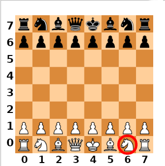

Zadanie polega na stworzeniu klasy reprezentującej szachownicę, oraz zestawu klas, reprezentujących różne pionki.

**Nie musisz umieć grać w szachy. Treść polecenia i testy automatyczne sprawią, że będziesz wiedział dokładnie co masz zaprogramować.**

*Nie będziemy implementować wszystkich zasad gry w szachy - zaawansowane zasady (promocja, bicie w przelocie, roszada, etc.) zostawiamy do napisania ochotnikom. Również wykrywanie końca gry nieznacznie uprościmy (z punktu widzenia programisty): króla należy zbić, tak samo jak zbija się pozostałe figury.*

Do zadania są dołączone testy jednostkowe, które można włączać po - lub nawet przed skończeniem etapu. W drugim etapie dowiesz się, jak to zrobić.

## Klasa `Chessboard`

Będziemy potrzebowali klasy `Chessboard`, za pomocą której gracze będą mogli wpływać na pozycje pionków. Klasa nie będzie przyjmowała żadnych argumentów. Instancja klasy `Chessboard` powinna otrzymać atrybuty:
- `color` o wartości `"white"` aby zapamiętać, który gracz ma wykonać następny ruch (w trakcie gry będzie zmieniać wartość na `"black"`, i znowu `"white"`, itd.),
- `board`, którego wartością będzie (na tym etapie pisania kodu) lista ośmiu list, a każda wewnętrzna lista powinna mieć osiem wartości `None`.

Układ współrzędnych naszej szachownicy wygląda jak na obrazku poniżej. Pierwszą liczbą będzie numer kolumny, drugą będzie numer wiersza, zatem `board[6][0]` (liczymy od zera!) będzie wskazywać białego skoczka, na obrazku blisko prawego dolnego rogu.



[Ruchy poszczególnych figur są opisane tutaj.](https://en.wikipedia.org/wiki/Chess#Movement)

Testy do tego etapu są już włączone.


## Klasa `Pawn` (testy: `TEST_PAWNS`)

Ta klasa będzie reprezentować pionki. Każdy pionek musi wiedzieć jaki ma kolor (`"white"` albo `"black"`) oraz na jakiej pozycji stoi w danej chwili (`x` i `y` o wartościach od 0 do 7 włącznie). Wszystkie te informacje zostaną mu przekazane poprzez metodę `__init__`.

Aby włączyć testy tego etapu, w pliku `test_chess.py` zmień wartość zmiennej `TEST_PAWNS` na `True`.

**Napisz klasę** `Pawn`, której metoda `__init__` przyjmie trzy argumenty: `color`, `x` i `y`. Zapamiętaj je w instancji pod takimi nazwami.

**Napisz metodę** `list_allowed_moves(chessboard)`, która zwróci listę tupli - każda tupla będzie zawierała dwie liczby: współrzędne `(x, y)` na które dany pionek może przejść. Pamiętaj, że tradycyjnie białe pionki znajdują się na dole planszy (w wierszu nr 1, według numeracji z obrazka powyżej) i przesuwają się o jedno pole w kierunku wierszy o wyższych numerach, natomiast czarne przesuwają się w kierunku wierszy o niższych numerach. Dodatkowo, **tylko** w pierwszym ruchu **mogą** przeskoczyć o 2 pola.

Do metody `list_allowed_moves(...)` będziemy przekazywali całą szachownicę - dzięki temu pionek będzie mógł się w przyszłości "rozejrzeć" i sprawdzić, gdzie może przeskoczyć. Na razie załóżmy, że pionek jest sam na planszy - do tematu rozglądania się jeszcze wrócimy.

Zatem biały pionek w miejscu `(x, y)` może przeskoczyć na pole `(x, y+1)`, a jeśli jest to jego pierwszy ruch, to gracz ma do wyboru `(x, y+1)` lub `(x, y+2)`. Dla czarnego pionka będzie to natomiast odpowiednio `(x, y-1)` oraz `(x, y-1)` lub `(x, y-2)`.

Pamiętaj, że pionek nie może spaść z planszy! Gdy dotrze do końca szachownicy, metoda `list_allowed_moves(...)` powinna zwrócić pustą listę (uproszczenie na potrzeby zadania).

**Napisz metodę** `move(x, y)` która zapamięta nową pozycję, na którą pionek został przeniesiony - tj. ustaw wartość `self.x` i `self.y` na takie, jakie zostały przekazane w argumencie do metody. Dodatkowo, w przypadku pionka musisz też zapamiętać, że został ruszony - i że od tej pory może skakać już tylko o jedno pole.

## Klasa `Knight` (testy: `TEST_KNIGHTS`)

Ta klasa będzie reprezentować skoczki. Podobnie jak w przypadku pionków, metoda `__init__` musi przyjąć i zapamiętać kolor i współrzędne tworzonego skoczka. [Tutaj](https://en.wikipedia.org/wiki/Chess#Movement) dowiesz się, jakie ruchy może wykonać skoczek.

Tu także napisz metody `list_allowed_moves` oraz `move`.

## Klasa `Rook` (testy: `TEST_ROOKS`)

Kolejna klasa, która implementuje zachowanie kolejnej figury szachowej. Jej interfejs musi być zgodny z interfejsami pozostałych figur, tj. jej metody `list_allowed_moves` oraz `move` muszą zachowywać się tak samo jak te z klas `Pawn` oraz `Knight`. Dodatkowo, metoda `__init__` także powinna zachowywać się analogicznie do poprzednich klas.

## Klasa `King` (testy: `TEST_KINGS`)

Analogicznie do powyższych.

## Chwila na refaktor

Zauważ, że w kodzie (prawie) każdej figury powtarzają się metody `__init__` i `move`. Zamiast kopiować ich kod, napisz ponad wszystkimi figurami klasę `Figure` i do niej przenieś obie metody. Figury (pion, skoczek, wieża, etc.) dziedzicząc z `Figure`, będą używać jej metod `__init__` i `move`.

Pion jest wyjątkiem - oprócz pozycji i koloru musi pamiętać jeszcze, czy wykonał już pierwszy ruch. W metodzie `__init__` klasy `Pawn` użyj `super()` aby skorzystać z tego, co oferuje klasa-rodzic, i uzupełnij to czego jej brakuje.

Do tej części nie są przygotowane żadne testy. Te, które testowały klasy `Pawn`, `Knight`, `Rook` i `King` do tej pory wystarczą, aby potwierdzić poprawność działania klas po refaktoryzacji.

## Klasa `Bishop` (testy: `TEST_BISHOPS`)

Analogicznie do powyższych.

## Klasa `Queen` (testy: `TEST_QUEENS`)

Analogicznie do powyższych. Zauważ, że ruchy możliwe do wykonania przez królową to suma możliwych ruchów gońców i wieży - zamiast kopiować kod, spróbuj go odpowiednio zorganizować. W tym celu możesz w klasie `Figure` dopisać dwie metody pomocnicze: `_get_diagonal_moves(...)` i `_get_horizontal_and_vertical_moves(...)`. Podkreślniki na początku nazw metod podpowiedzą, że są to metody na użytek wewnętrzny klasy oraz klas dziedziczących.


## Zapełnianie planszy (testy: `TEST_BOARD_START`)

Do tej pory atrybut `board` w obiektach typu `Chessboard` zawierał listę list, które były wypełnione wartościami `None` - plansza była całkiem pusta.

Napisz metodę `setup()`, która ustawi na szachownicy wszystkie figury - tylko środkowe cztery wiersze powinny pozostać puste.

## Wyświetlanie szachownicy na ekranie

Funkcja do wyświetlania planszy jest już przygotowana, ale wymaga aby wszystkie klasy figur szachowych były stworzone - czyli na tym etapie powinna już działać! Funkcja nazywa się `show(...)` i wymaga podania całego obiektu typu `Chessboard`.

Aby nieco uprościć zadanie i nie pogubić się w obliczeniach, przyjmiemy że pola mają współrzędne **x** i **y** o wartościach **0-7**, zamiast tradycyjnych **A-H** i **1-8**.

**Uwaga! W konsoli z ciemnym tłem, czarne figury mogą wyglądać jak białe, a białe jak czarne!**


## Interfejs klasy `Chessboard` - metoda `list_allowed_moves` (testy: `TEST_BOARD_LISTING_MOVES`)

Na razie tylko same figury miały metodę `list_allowed_moves`. W trakcie działania programu nie będziemy wchodzić bezpośrednio w interakcję z figurami - wszelkie decyzje graczy odbierze instancja klasy `Chessboard`, i to ona dopilnuje aby stan jej samej oraz figur był spójny, oraz aby gra przebiegała zgodnie z zasadami.

Do klasy `Chessboard` dopisz metodę `list_allowed_moves(x, y)`, która zwróci listę ruchów, jakie wskazana (poprzez `x` i `y`) figura może wykonać. Metoda ta powinna sięgnąć po figurę na szachownicy, a następnie jej zapytać, gdzie może się przemieścić - i tą informację zwrócić.

Uwaga:
- jeśli kolor wskazanej figury jest inny niż kolor gracza na którego ruch czekamy, metoda ma zwrócić `None`,
- jeśli wskazane pole nie ma żadnej figury, metoda ma zwrócić `None`.

Kolor gracza, który ma w danej chwili wykonać ruch, znajdziesz w atrybucie `color` instancji `Chessboard`.


## Interfejs klasy `Chessboard` - metoda `move` (testy: `TEST_BOARD_MOVING`)

Metoda `move` klasy `Chessboard` będzie przyjmować 4 argumenty:
- współrzędna `from_x` figury, która będzie przesuwana
- współrzędna `from_y` figury, która będzie przesuwana
- docelowa współrzędna `to_x`
- docelowa współrzędna `to_y`

Metoda musi sprawdzić (za pomocą `list_allowed_moves` szachownicy), czy figura pod adresem `(from_x, from_y)` może zostać przesunięta na miejsce `(to_x, to_y)`. Jeśli tak, powinna uruchomić metodę `move` **figury** (nie szachownicy!), aby powiadomić ją o zmianie jej miejsca, a następnie na szachownicy (tj. w atrybucie `board`) przenieść figurę z adresu `.board[from_x][from_y]` do adresu `.board[to_x][to_y]`.

Takie przeniesienie można zrealizować w dwóch krokach:
1. do `.board[to_x][to_y]` przypisz obecną wartość `.board[from_x][from_y]`,
2. do `.board[from_x][from_y]` przypisz `None`.

Po zakończeniu przesuwania figury, metoda powinna zmienić wartość atrybutu `color` szachownicy, aby następny ruch mógł wykonać przeciwnik.

Jeśli gracz próbuje wykonać niedozwolony ruch, metoda powinna rzucić wyjątek `ValueError`.

Metoda po zakończeniu działania powinna zwrócić `None`. Nie musisz pisać `return None` - jeśli działanie metody się po prostu zakończy (ponieważ metoda nie ma już więcej kodu do wykonania), `None` zostanie z niej zwrócone automatycznie.


## Ograniczanie ruchów figur

Do tej pory figury, podczas generowania listy możliwych ruchów, zakładały że są same na planszy. Pora to poprawić:
1. figury mają prawo przemieścić się po pustych polach,
2. figura ma prawo zbić (zastąpić na szachownicy) figurę przeciwnika - nie może natomiast jej przeskoczyć,
3. figura nie może zbić ani przeskoczyć figury o tym samym kolorze.

Tylko skoczek (`Knight`) może przeskakiwać nad innymi figurami.

Specjalnego traktowania wymaga też pionek (`Pawn`) - może on zbić figurę przeciwnika ruszając się o jedno pole do przodu po skosie.

Testy do tej części to:
- `TEST_PAWNS_KILLING_THE_ENEMY`
- `TEST_ROOKS_KILLING_THE_ENEMY`
- `TEST_KNIGHTS_KILLING_THE_ENEMY`
- `TEST_BISHOPS_KILLING_THE_ENEMY`
- `TEST_KINGS_KILLING_THE_ENEMY`
- `TEST_QUEENS_KILLING_THE_ENEMY`
- `TEST_PAWNS_NOT_KILLING_ALLIES`
- `TEST_ROOKS_NOT_KILLING_ALLIES`
- `TEST_KNIGHTS_NOT_KILLING_ALLIES`
- `TEST_BISHOPS_NOT_KILLING_ALLIES`
- `TEST_KINGS_NOT_KILLING_ALLIES`
- `TEST_QUEENS_NOT_KILLING_ALLIES`


## Wykrywanie końca gry (testy: `TEST_GAME_END`)

Wykrywanie końca gry będzie nieco uproszczone - król musi zostać zbity. Gdy król zostanie zbity, metoda `move` klasy `Chessboard` powinna zwrócić `"WHITE WON"` lub `"BLACK WON"`.

Aby sprawdzić, czy dana figura (tj. ta, która będzie za chwilę nadpisana figurą przeciwnika) jest instancją jakiejś klasy, możesz użyć funkcji `type`:

```python
type(chess_figure_to_be_tested) == King
```

lub funkcji `isinstance`:

```python
isinstance(chess_figure_to_be_tested, King)
```

# Podsumowanie

Mam nadzieję, że powyższa gra pokazała Ci w praktyce, jak w praktyce można wykorzystać 4 cechy programowania obiektowego. Jeśli ich nie dostrzegasz, poniżej znajdziesz szczegółowy opis wykorzystania każdej z nich.

## Abstrakcja

Funkcjonalność każdej figury została ograniczona do absolutnego minimum - wystarczy, że klasa ma metody `list_allowed_moves` i `move`, aby spełnić wymagania szachownicy i móc wziąć udział w grze.

Klasy `Pawn`, `Rook`, `King`, etc. skupiają się wyłącznie na aspekcie logicznym gry - nie mają nawet metod aby samodzielnie wyświetlić się na ekranie! Również klasa `Chessboard` nie ma metody do wyświetlania się na ekranie - `show` jest odrębną funkcją. Metoda `move` klasy `Chessboard` nie używa w swoim kodzie funkcji `input()` aby zapytać gracza o ruch - oczekuje, że "ktoś inny" (np. kod w pliku `game.py`) zajmie się dostarczeniem jej wszystkich danych do działania.

Takie oddzielenie logiki gry od sposobu komunikacji z użytkownikiem sprawia, że logikę (klasa `Chessboard` i wszystkie figury) można użyć na wiele sposobów w wielu miejscach -
- w aplikacji konsolowej (tj. `game.py`),
- w aplikacji webowej (np. z użyciem biblioteki `Flask`),
- w dowolnym innym miejscu, które pozwala na uruchamianie kodu Pythona.

## Hermetyzacja

Przykład hermetyzacji znajdziesz w metodach `move` klas `Chessboard` oraz wszystkich figur (lub jednej, bazowej `Figure` jeśli zdecydowałeś się na refaktor). Każda z tych metod zawiera kod, który musi wykonać się w całości, w ściśle określonej kolejności aby zachować spójność danych wszystkich obiektów. Wyobraź sobie, co by się stało, gdybyśmy zapomnieli uaktualnić jednej współrzędnej jednej figury - "myślałaby" że jest w innym miejscu, niż wyświetla się graczom na ekranie!

## Dziedziczenie

Dziedziczenie pozwoliło na uporządkowanie kodu i wyeliminowanie powtarzanych fragmentów - metody `move` figur niczym się od siebie nie różniły, wystarczyło zatem napisać ją raz (w klasie `Figure`), i zadeklarować, że `King`, `Queen`, etc. dziedziczą z klasy `Figure`. Oznacza to, że `King`, `Queen`, etc. **odziedziczyły** metodę `move` i mogą jej używać tak jakby to była ich własna metoda.

## Polimorfizm

Polimorfizm wykorzystaliśmy aby klasa `Chessboard` nie musiała wiedzieć wszystkiego o każdej figurze na szachownicy. Zamiast tego, klasa `Chessboard` "wie", że może dowolnej figury zapytać o jej listę możliwych ruchów za pomocą jej metody `list_allowed_moves`, i powiadomić o zmianie jej miejsca za pomocą metody `move`.

Taka organizacja kodu pozwala na łatwe rozbudowywanie gry o nowe figury! Możesz spróbować stworzyć własne, poniżej znajdziesz przykłady (pamiętaj, że uzupełnienia będzie też wymagała funkcja `show`):
- `Rabbit` - porusza się we wszystkich kierunkach, ale może przeskakiwać figury, zarówno swoje, jak i przeciwnika,
- `Polonez` - znany m.in. z tego, że ma mały promień skrętu. Skacze zawsze o dwa pola, porusza się we wszystkich kierunkach, ale nie może skręcać pod kątem 90 stopni (jeśli w którymś ruchu przesunął się o 2 pola do przodu, to przy kolejnym nie może ruszyć się w lewo ani w prawo).
